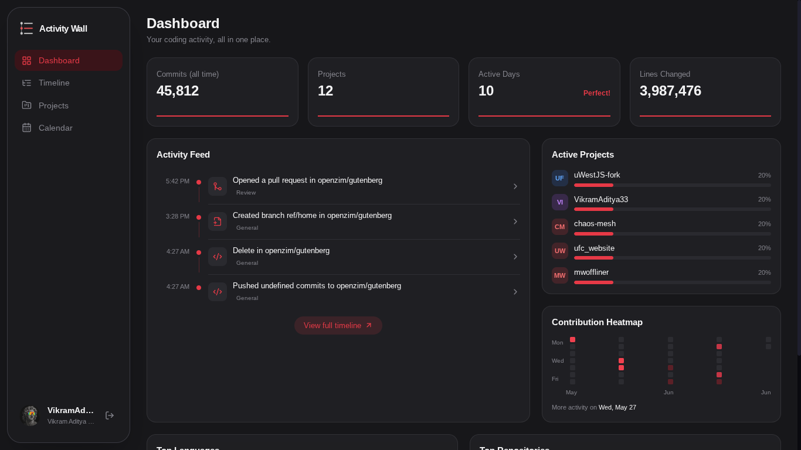

# Activity Wall

Activity Wall is a modern dashboard that turns GitHub activity into a clean, easy-to-read overview of your projects, repositories, commits, and development progress.

## Preview

## Contributing

Contributions are welcome! If you have an idea, find a bug, or want to improve Activity Wall, feel free to open an issue or submit a pull request.

## License

This project is licensed under the MIT License.
